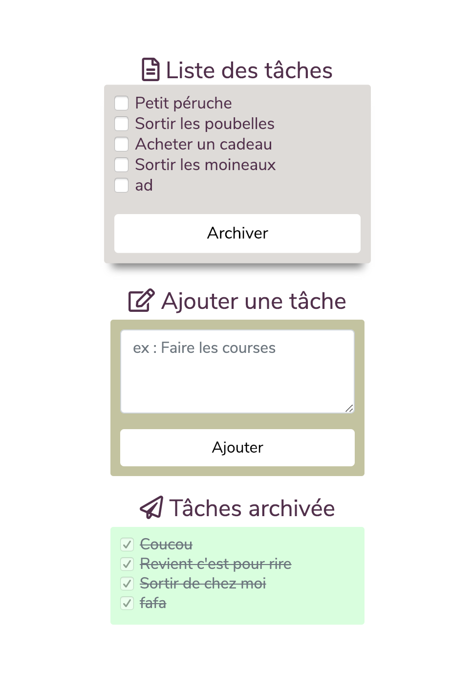

# TodoList Ajax

### Form layout


### Using
```
cd 'your server place'
git clone https://github.com/bouzouitadavid/todolist-ajax
chmod 777 models/todo.json 
```
For change SCSS
If you don't have npm install compass
```
cd assets
compass watch
```
> Remember chmod 777 on todo.json !

### Techno using
Ajax, php, json, javascript, mvc, bootstrap, sass, compass

### To do
- [ ] Add drag and drop
- [x] Correct the MVC folders and files position


